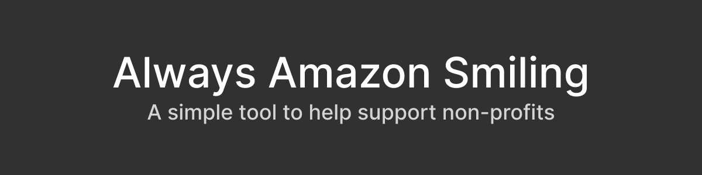

[Download via the Chrome Web Store](https://chrome.google.com/webstore/detail/ioeinegegnpkndnbkmmhhhaljlfpemgf)

[Download via the Firefox Add-ons Shop](https://addons.mozilla.org/en-US/firefox/addon/always-amazon-smiling/)

[Download via the Opeara Addons Shop](https://addons.opera.com/en/extensions/details/always-amazon-smiling/)

Always Amazon Smiling (abbreviated to AAS) is a simple extension that redirects requests to compatible Amazon sites to their Amazon Smile counterparts. This allows you to easily support the charities/non-profits that you love.

AAS is built privacy-first. All processing of the URL you're on is done on your computer. It's never sent to me or a third-party (mostly because I have no need for that).

### Building
Using Yarn, install the dependencies (`yarn`) and Gulp's CLI tool (`yarn global add gulp-cli`). Then, simply run `gulp`. This will compile to the `build/` directory, however it will not be compressed into a CRX, ZIP, XPI, etc.

### Tested Browsers
- Brave 1.8.86-1.11.104 / Chromium 81.0.4044.129-84.0.4147.105 (Should work for Chrome and other Chromium-based browsers)
- Firefox 75.0 (Should work for other Firefox-based browsers)
